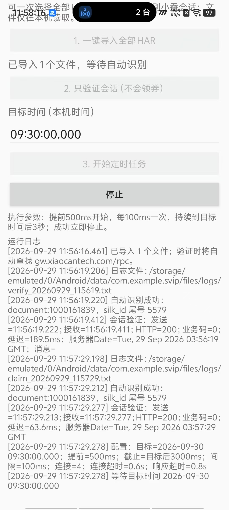
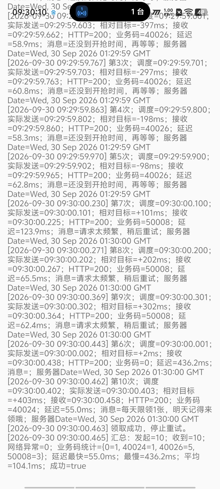
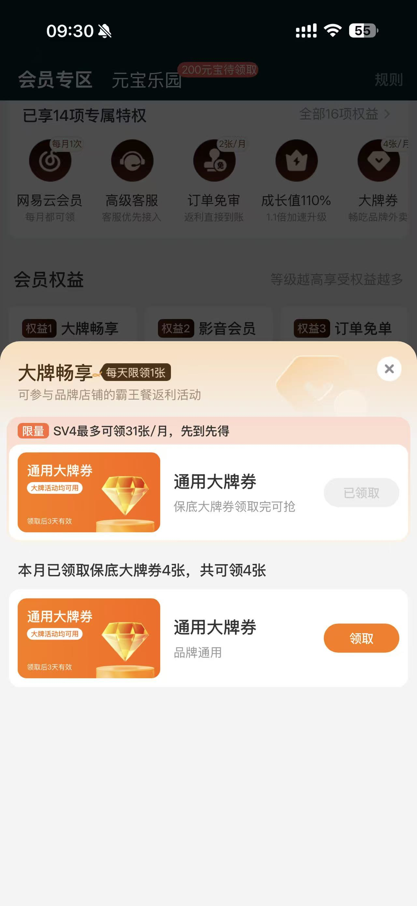
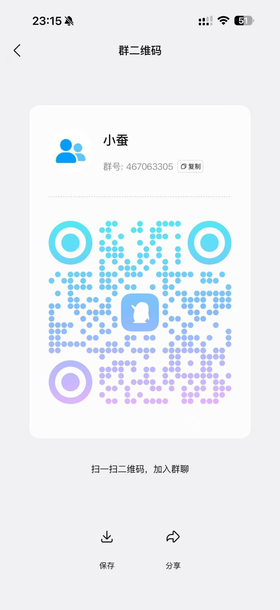

# SVIP Timer Android

这是一个用于领取 **小蚕惠生活 SVIP 大牌券** 的 Android 定时工具。应用可以从你自己导出的 HAR 文件中识别登录会话，在设定时间前预热连接并执行领取请求。

> 当前版本：**2.4.2**（versionCode 8）  
> 最低系统：Android 8.0（API 26）  
> APK SHA-256：`C629C02D6D84AEE20058AD2F592FEEB28D28F1016EED71FB0ADA9F2A627D28D7`

## 用途说明

- 目标服务：**小蚕惠生活**；
- 目标权益：**SVIP 会员专区 → 大牌畅享 → 通用大牌券**；
- 默认目标时间：每天 `09:30:00.000`；
- 工具会在目标时间前预热并按配置重试，服务器返回成功后停止提交新请求；
- 页面名称、开放时间、资格和数量可能由平台调整，请以小蚕惠生活当天页面为准。

## 实测成功截图

以下截图展示了本人账号的任务配置、成功日志和小蚕惠生活权益页面中的领取结果。截图仅用于说明实际运行效果，不代表每个账号或每天都一定成功。

### 1. 会话识别并等待定时任务



### 2. 领取成功日志

日志中可见业务码 `0`、`领取成功，停止重试`，以及最终汇总 `成功=true`。



### 3. 小蚕惠生活大牌券已领取

小蚕惠生活会员专区的大牌畅享页面显示保底通用大牌券为“已领取”。



## QQ 交流群

使用问题、版本更新和测试反馈可加入 QQ 群：**467063305**。APK 内也已加入群号复制按钮和二维码。



## 用途说明

- 目标服务：**小蚕惠生活**；
- 目标权益：**SVIP 会员专区 → 大牌畅享 → 通用大牌券**；
- 默认目标时间：每天 `09:30:00.000`；
- 工具会在目标时间前预热并按配置重试，服务器返回成功后停止提交新请求；
- 页面名称、开放时间、资格和数量可能由平台调整，请以小蚕惠生活当天页面为准。

## 实测成功截图

以下截图展示了本人账号的任务配置、成功日志和小蚕惠生活权益页面中的领取结果。截图仅用于说明实际运行效果，不代表每个账号或每天都一定成功。

### 1. 会话识别并等待定时任务


### 2. 领取成功日志

日志中可见业务码 `0`、`领取成功，停止重试`，以及最终汇总 `成功=true`。


### 3. 小蚕惠生活大牌券已领取

小蚕惠生活会员专区的大牌畅享页面显示保底通用大牌券为“已领取”。


## 重要说明

- 仅用于你自己的账号、设备和会话。
- **HAR 文件相当于临时登录凭证**，不要发给别人，不要上传到 GitHub、网盘或群聊。
- 本仓库只放 APK 和说明文档，不包含任何 HAR、Cookie、Token 或账号数据。
- 自动请求不保证成功；网络、服务器限流、会话过期和手机省电策略都会影响结果。
- 请遵守目标服务的用户协议和活动规则。

## 2.4.2 更新内容

- 新增 QQ 交流群 `467063305`；
- 新增一键复制群号按钮；
- 新增群二维码展示；
- 保留 2.4.1 的定时与连接调度逻辑。

## 2.4.1 更新内容

- 目标时间前 500ms 开始尝试，临近整点自动加密请求节奏；
- 使用 4 条连接，并在整点前保留 1 条连接给 0ms 关键请求；
- 收到成功结果立即停止，其余响应仍写入日志；
- 对连接占用、超时和服务器限流结果做了更稳健的处理。

> 抢券结果仍受账号资格、库存、网络和平台响应影响，不承诺每次成功。
## 一、下载安装 APK

1. 在仓库文件列表中找到 `SVIP-timer-v2.4.2-qq.apk`。
2. 点击文件，再点击 **Download raw file（下载原始文件）**。
3. 手机上打开下载完成的 APK。
4. 如果系统提示“禁止安装未知应用”，进入设置，只对当前浏览器或文件管理器临时允许安装。
5. 安装完成后打开 **SVIP定时助手**。

如果手机提示“应用未安装”：

- 先卸载以前不同签名的旧版本，再安装本版本；
- 确认 Android 版本不低于 8.0；
- 重新下载 APK，避免文件不完整。

## 二、开始前的手机设置

1. 打开 **设置 → 日期和时间**；
2. 开启 **自动设置时间** 和 **自动设置时区**；
3. 在电池设置中把本应用设为“不限制”或“允许后台活动”；
4. 运行任务时保持应用在前台、屏幕常亮；
5. 使用稳定网络，执行时不要切换 Wi-Fi 和移动网络；
6. 建议连接充电器。

## 三、HAR 是什么

HAR 是网络请求记录文件。应用需要从 HAR 中读取你自己的登录会话，然后才能验证账号并执行任务。

抓取 HAR 时只需要开始抓包，打开目标小程序或 App，进入会员/大牌券页面让页面正常加载一次，然后停止抓包并导出 `.har` 文件。

**抓包时不需要真的领取，也不需要等到 09:30。** 页面正常加载并产生相关接口请求即可。

## 四、用 Reqable 抓 HAR（新手步骤）

菜单名称可能因 Reqable 版本略有不同。

### 方案 A：直接在 Android 手机上抓取

1. 安装并打开 Reqable。
2. 按应用提示安装 Reqable CA 证书。
3. 进入手机 **设置 → 安全/更多安全设置 → 加密与凭据 → 安装证书 → CA 证书**，选择 Reqable 导出的证书。
4. 返回 Reqable，开启抓包或 VPN 模式。
5. 在应用选择中只勾选目标 App；抓微信小程序则勾选微信。
6. 清空旧请求，点击开始抓包。
7. 打开目标 App 或微信小程序，登录自己的账号。
8. 进入会员专区、大牌券页面，等待页面完整显示。
9. 返回 Reqable，停止抓包。
10. 搜索域名 `gw.xiaocantech.com`。
11. 确认能看到类似 `https://gw.xiaocantech.com/rpc` 的请求。
12. 点击导出/分享，格式选择 **HAR**，保存到“下载”目录。

如果只能看到 `CONNECT`、看不到 HTTPS 内容：

- CA 证书没有正确安装或信任；
- 目标 App 可能启用了证书锁定；
- 可以改用下面的“手机连接电脑代理”方案；
- Android 7 以后部分 App 不接受用户 CA，这不一定是操作错误。

### 方案 B：手机连接电脑 Reqable 抓取

1. 电脑和手机连接同一个 Wi-Fi。
2. 在电脑 Reqable 顶部找到代理地址，例如 `192.168.x.x:9000`。
3. 手机打开当前 Wi-Fi 的详细设置，把代理改成“手动”。
4. 主机名填写电脑显示的局域网 IP，端口填写 Reqable 端口。
5. 在手机浏览器打开 Reqable 提供的证书地址，下载 CA 证书。
6. 在手机系统设置中安装并信任该 CA 证书。
7. 电脑 Reqable 清空旧记录并开始抓包。
8. 手机上打开目标 App/微信小程序，进入会员和大牌券页面。
9. 电脑 Reqable 搜索 `gw.xiaocantech.com`。
10. 找到 `/rpc` 请求后，右键导出为 HAR。
11. 抓取完成后，把手机 Wi-Fi 代理恢复为“无”，避免以后无法联网。

### iPhone 抓取提示

1. iPhone 与电脑连接同一个 Wi-Fi；
2. 在 Wi-Fi 详情页把 HTTP 代理设为手动，填写电脑 IP 和 Reqable 端口；
3. 下载并安装 Reqable CA 描述文件；
4. 进入 **设置 → 通用 → 关于本机 → 证书信任设置**，为该 CA 开启完全信任；
5. 完成抓取后关闭 Wi-Fi 代理，并根据需要删除 CA 描述文件。

## 五、如何判断 HAR 抓对了

- 文件扩展名是 `.har`，并且不是 0 KB；
- Reqable 中能搜到 `gw.xiaocantech.com`；
- 能看到 `/rpc` 的 POST 请求；
- 抓取时账号已经正常登录。

不确定哪个 HAR 有效也没关系：可以一次选择多个 HAR，应用会逐个扫描并自动识别。

## 六、把 HAR 导入 APK

1. 把 HAR 保存到手机“下载”目录；
2. 打开 **SVIP定时助手**；
3. 点击 **1. 一键导入全部 HAR**；
4. 在文件选择器中长按并多选所有可能相关的 HAR；
5. 返回应用，看到“已导入 N 个文件，等待自动识别”；
6. 点击 **2. 只验证会话（不会领券）**。

验证成功应看到“自动识别成功”、HTTP `200`、业务码 `0` 和请求延迟。如果会话失效或未找到会话，请重新登录后再抓一次 HAR。

## 七、设置和启动定时任务

1. 在“目标时间”中填写时间，格式为 `HH:mm:ss.SSS`；
2. 例如每天 09:30：`09:30:00.000`；
3. 建议在目标时间前 5～10 分钟再次验证会话；
4. 验证成功后点击 **3. 开始定时任务**；
5. 日志应显示具体日期和“等待目标时间”；
6. 不要点击“停止”，保持应用前台亮屏。

当前执行参数：

- 目标前 500ms 开始；
- 每 100ms 调度一次；
- 使用 4 条连接；
- 持续至目标时间后 3 秒；
- 连接超时 0.6 秒；
- 响应超时 0.8 秒；
- 业务码为 0 时记录成功并停止提交新请求。

0.8 秒是异常请求的最长响应等待时间，并不是每次发送前等待 0.8 秒，其他空闲连接仍会继续工作。

## 八、日志在哪里

日志显示在应用页面，并保存在：

```text
/storage/emulated/0/Android/data/com.example.svip/files/logs/
```

- `verify_年月日_时分秒.txt`：验证日志；
- `claim_年月日_时分秒.txt`：任务日志。

部分系统文件管理器看不到 `Android/data`，可以通过 USB 在电脑上查看，或直接复制应用界面中的日志。

## 九、常见业务码和现象

具体含义以日志中的服务器消息为准：

- `0`：请求成功；
- `40026`：还没到开放时间；
- `50008`：请求太频繁；
- “每天限领1张”：通常表示本日已经领取；
- HTTP 200 但业务码非 0：网络正常，服务器拒绝了该次业务请求；
- timeout：该连接没有及时收到响应，不代表全部连接停止。

## 十、故障排查

### 导入后找不到会话

- 确认抓包期间进入过会员/大牌券页面；
- 搜索 `gw.xiaocantech.com`；
- 确认导出的是 HAR，而不是图片、文本或证书；
- 重新登录并重新抓取。

### 验证显示超时

- 关闭其他 VPN、加速器和代理；
- 切换到更稳定的网络；
- 确保抓包代理已关闭；
- 稍后重新验证。

### 到时间没有执行

- 检查目标日期是否被自动安排到明天；
- 开启自动时间和自动时区；
- 关闭省电模式和电池优化；
- 保持应用前台和屏幕常亮；
- 不要清理后台或重启手机。

### 成功附近还有其他错误码

并发请求可能几乎同时到达服务器，成功请求附近出现“请求太频繁”或“每天限领1张”是可能的。以账号权益页面和日志中的成功记录为准。

## 十一、安全清理

1. 删除不再使用的 HAR；
2. 删除聊天或网盘中误传的 HAR；
3. 关闭抓包软件和系统代理；
4. 不再需要抓包时删除用户 CA 证书；
5. 如果怀疑 HAR 泄露，立即退出账号并重新登录，使旧会话失效。

## 校验 APK

Windows PowerShell：

```powershell
Get-FileHash .\SVIP-timer-v2.4.2-qq.apk -Algorithm SHA256
```

正确结果：

```text
C629C02D6D84AEE20058AD2F592FEEB28D28F1016EED71FB0ADA9F2A627D28D7
```

